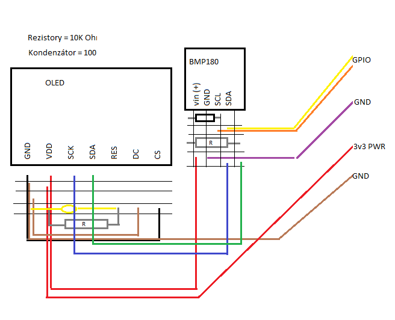

# NAG-IoT
## Cisco Zahradníci

### 1. Příprava
#### a) Raspberry Pi 3
##### Volba jazyka
Volili jsme ze dvou jazyků – Python a JavaScript. Python se z počátku zdál jako lepší varianta, protože velikost komunity v oboru IoT je jednoznačně větší než u JS. To je výhoda jednak v množství dostupných knihoven a kvalitě jejich dokumentace, a jednak v četnosti návodů, jak s určitými součástkami pracovat. Avšak problém byl, že python znal pouze jeden člen našeho týmu a mohli tak vzniknout problémy v případě jeho absence. Javascript jsme na druhou stranu více méně znali všichni a měli jsme tak možnost kód všichni poupravit, vyžádala-li by si to situace. Pro práci s JS jsme použili Node.js a na správu jeho balíčků NPM. Pro verzování a cloudové uskladnění jsme používali GIT s repositářem na stránce [github.com](https://github.com/JanSkvaril/cisco1 "github.com").

##### Zapojení
Díky tomu, že máme nejlepší možné Raspberry Pi B+, tak jeho příprava šla poměrně snadno, pro prvotní nastavení jsme připojili Raspberry k monitoru a k němu ještě klávesnici + myš, systém Raspbian byl již přiložen na SD kartě, tudíž jsme jen provedli nutné aktualizace a nastavili v Raspberry sítě. Následně jsme také přidali programy pro vzdálené ovládání (VNC Viewer) a také pro psaní samostatných programů v námi zvoleném Javascriptu. Obraz celé SD karty jsme si pro jistotu zálohovali, kdyby se něco neočekávaného stalo a my potřebovali čistý systém, kam bychom jen přidali samostatně zálohované kódy. Jako další jsme si vytiskli rozložení pinů na Raspberry pro snadnější práci a zapojování a ve finále jsme vytiskli krabičku pro Raspberry, aby jej bylo možné snadno uložit a přenášet.

##### Konfigurace

#### b) Arudino Pro Micro
##### Zapojení
Arduino jsme si připravili a jako první věc jsme připájely 2 řady pinů, které byly zabaleny u něj, abychom mohli zapojovat senzory a pracovat s ním. Na počítači si připravili Arduino IDE a začali pracovat na realizaci připojení senzorů na nepájivém poli. Samotné Arduino jsme zasunuli do nepájivého pole a v řadách odpovídajících pinů začali zapojovat vodiče pro práci se senzory.

##### Vývojové prostředí
Pro programování arduina jsme použili doporučené [Arduino IDE](https://www.arduino.cc/en/main/software "Arduino IDE"). Po instalaci na PC jsme museli změnit v menu Nástroje vývojovou desku na Arduino/Genuino Micro.

### 2. Testování GPIO
#### a) LED / bzučák
Začali jsme s jednoduchým testováním GPIO portů a jejich ovládáním. Jako první jsme začali s LED diodou, kterou jsme zapojili do nepájivého pole a do odpovídajících zdířek jsme z gpio portu vyvedli vodič ke katodě a k výstupu přidali 330 Ohmový rezistor, od kterého vedli vodič zpátky k Raspberry k pinu GND. To samé jsme zopakovali s bzučákem, u kterého odpadla nutnost přidávat rezistor.
##### Programování  zapnutí / vypnutí LED
Pro zapnutí a vypnutí LED jsme použili knihovnu [onoff](https://www.npmjs.com/package/onoff "onoff"). Do našeho projektu jsme ji přidali příkazem `npm install onoff`. Poté už jen stačilo vytvořit jednoduchý script. Nejdříve jsme si pomocí `require()` vyžádali knihovnu a vytvořili novou instanci třídy GPIO s dvěma parametry – číslo pinu, na kterém je led připojena, a specifikovali, že se jedná o výstup. Nakonec jsme jen zavolali metodu objektu `writeSync()` s parametrem 1 – tím jsme led zapnuli.

#### b) Řízení výkonu na GPIO portu
Jako další krok jsme pomocí stejného zapojení jak v úloze a), akorát se změnou v kódu vyzkoušeli možnosti PWM (pulse width modulation) jak na led diodě, tak bzučáku. Jako poslední

#### c) LED RGB
Diodu jsme zapojili tak, že nejdelší nožička (2), bude navazovat na vodič, který povede do GND pinu na Raspberry, ostatní tři nožičky (které zprostředkovávají) zelenou, červenou a modrou, jsme napojili tak, že jsme využili 3x 330 Ohm rezistory, pro každou nožičku zvlášť a pak už jen vedli vodič do Raspberry na GPIO piny.

##### Řízení LED pomocí PWM - úloha b) a c)
Pro ovládání led pomocí PWM jsme použili knihovnu [pigpio](https://www.npmjs.com/package/pigpio "pigpio"). Ve skutečnosti se jedná o wrapper na [knihovnu pigpio v jazyce C](https://github.com/joan2937/pigpio "knihovnu pigpio v jazyce C"). Následný postup byl téměř totožný, s tím rozdílem, že jsme místo pouze binární hodnoty mohli nastavit hodnotu od 0 do 255, která určovala sílu svitu LED.

#### d) Port – vstupní režim (push button)
Pro připojení jsme zvolili push button, u kteréhose při stlačení vypsal text v konzoli. Připojení opět bylo velice jednoduché – vyvedení z GND pinu, do switche a ze switche zpátky vodičem na GPIO pin.
##### **z nějakého důvodu nemáme** !!!!!!!!!!!!!!!!!!!!!!!!!!!!!!!!!!!!!!!!!!!!!!!!!!

### 3. Oled, rotační encoder a senzory tlaku a teploty
#### a) Oled b) Senzor tlaku BMP180

#### a) Oled
Display jsme měli připojený přeš rozhraní **I2C**, které se museli v konfiguraci Raspberry nejdříve povolit. Pomocí `i2cdetect -y 1` jsme zjistili jakou má display adresu. Opět pomocí npm jsme nainstalovali knihovnu [rpi-oled](https://www.npmjs.com/package/rpi-oled "rpi-oled"). Po vyžádání knihovny jsme vytvořili instanci třídy oled, která jako parametr brala objekt s nastavením. Nastavili jsme pouze výšku a šířku (128x64). I2C adresa se shodovala s výchozí adresou, takže tu jsme specifikovat nemuseli. Poté jsme display vyčistili metodou `clearDisplay()` a přepsali černým obdélníkem pomocí metody `fillRect()`. Pro výpis textu na obrazovku jsme museli doinstalovat oled-font-5x7, jak bylo doporučeno v dokumentaci rpi-oled. Nakonec jsme pomocí `writeString()` vypsali textoví řetězec na display.

#### b) Sensor tlaku a teploty Bmp180
Sensor jsme napojily na rozhraní i2c. Opět jsme museli zjistit adresu sensoru pomocí příkazu `i2cdetect -y 1`. Pro práci se sensorem jsme použili knihovnu [RaspiSensors](https://www.npmjs.com/package/raspi-sensors "RaspiSensors"), kterou jsme stáhli a nainstalovali opět pomocí npm. Ve scriptu jsme po vyžádání knihovny vytvořili instanci třídy `RaspiSensors.Sensor`. Konstruktor třídy požadoval typ sensoru (což je BMP180) a jeho adresu (v našem případě to byla 0x77). Zjištění hodnot jsme provedly pomocí metody `fetch()`.

#### c) Senzor teploty DALLAS 18B20
Teplotní senzor je připojen dle rozdělení pinů. Vcc (+) se dělí o 3v3 napájecí port na Rpi s rotary encoderem, kousek za napájecím portem je také zapojen rezistor 330 Ohm, který vede k portu na data a vše je to zakončeno vývodem GND, který je zapojen do jednoho z GND portů na Rpi.

Sensor byl připojený přes rozhraní **1-Wire**, které bylo nutné v konfiguraci raspberry povolit. Použili jsme knihovnu [ds18b20](https://www.npmjs.com/package/ds18b20 "ds18b20") . Použitím metody `sensors()` jsme zjistili adresu našeho sensory. Získání hodnot ze senzoru jsme pak provedli zavolání metody `tempetureSync()`, která jako parametr brala zjištěnou adresu senzoru.

#### d) a e) Sestavení aplikace
Rotary encoder jsme připojili tak jak jsou udány porty na něm samotném. Všechny piny co z něj vedou končí v Raspberry, až na napájecí port, který je vyveden z nepájivého pole a dělí se o napájení s teplotním senzorem DALLAS.
CLK a DT určují strany a SW by měl indikovat zmáčknutí.

Pro aplikaci jsme použili script z 3. a) pro vypisování dat na display. Pro vypisování dat na display jsme použili scripty z 3. b) a 3. c). Pro práci s rotační encoderem jsme použili rozšíření dříve zmíněné knihovny [onoff-rotary](https://www.npmjs.com/package/onoff-rotary "onoff-rotary"). Při vytváření objektu rotátoru jsme museli určit piny ke, ke kterým je připojen. Poté jsme vytvořili funkci, která se s parametrem *direction* (směr) zavolala pokaždé, když nastala událost *rotation*.

### 4. Připojení na server
#### a) Připojení na server
Pro komunikaci se serverem jsme použili knihovnu [request](https://www.npmjs.com/package/request "request"). Požadavek na server jsme poslali tak, že jsme zavolali metodu `request()`. Pro získání všech proměnných, nebo konkrétní proměnné nám stačilo jako první parametr pouze zadat url a s naším API klíčem a jako druhý parametr callback funkci. Pro odeslání hodnoty proměnné na server jsme museli místo url vytvořit objekt s nastavením. Ten obsahoval url s klíčem, metodu (tedy metodu POST) a hodnotu, kterou chceme serveru poslat.

#### b) a c) Periodické odesílání dat na server
Pro odesílání dat ze senzorů na server stačilo skombinovat předešlé skripty (4a, 3bc). Stačilo jen přidat funkci, která se zavolala jednou za určitý čas a odeslala tak hodnoty na server.

### 5. Analogoví vstup na arduinu
Všechny senzory jsou připojeny na nepájivém poli (obr.1), + a – jsou zprostředkovány přes samotné přídavné USB napájení, které je v nepájivém poli a z dalších zdířek následně vede napájení samostatně do LED pásku a zbytek do řady pro napájení ostatních senzorů, napojených v řadě.
U všech senzorů jsou taky děličky napětí na + větvi.

#### a) Potenciometr 10K
Senzor jsme připojili na předem určených portech, + a – jsou vyvedeny z řady od přídavného napájení, bez potřeby rezistoru. Prostřední vývod je veden vodičem na řadu, kde je pin u arduina.

#### b) Fotorezistor
Senzor je připojen jednou nožičkou v řadě, kudy vede GND z přídavného napájení a vedle je vyveden rezistor, který vede k vodiči, který vede do analogového portu Arduina.

#### c) Čidlo teploty
Termistor je připojen stejně jako Fotorezistor.

#### Problém s analogovými sensory
Hlavní nevýhodou analogových sensorů je, že jejich výstup je ([dle dokumentace arduino](https://www.arduino.cc/en/tutorial/AnalogInput "dle dokumentace arduino")) v rozmezí 0 a 1023. To znamená, že například výstup z teplotního čidla je nic neříkající hodnota, která není v žádné reálné jednotce a je třeba sensor softwarově zkalibrovat pomocí jiného, přesného čidla. My hodnoty v našich úlohách na reálné jednotky nepřevádíme, jen je pomocí funkce `map()` (která bere argumenty: hodnota, minimální rozsah hodnoty, maximální, nový minimální rozsah, nový max rozsah) převedeme na potřebný rozsah (třeba 0 až 255 - rozsah barvy).

#### a), b) a c) Čtení hodnot z analogových sensorů
Čtení hodnot z analogových vstupů bylo poměrně jednoduché. V Arduino IDE byli předchystané příklady (viz. úvod úlohy 5) jak s analogovými vstupy pracovat, z čehož jsme čerpali. Stačilo pouze použít funkci `analogRead()`, která jako argument bere číslo pinu. Vzhledem k tomu, že kód je pro všechny čidla stejný prakticky stejný (jedinou změnou je číslo pinu), jsme úlohu celou úlohu 5 shrnuli do jednoho souboru.

##### Programování
Jak je zmíněno v úloze 1 b), pro programování arduina jsme použili Arduino IDE. Každý kód obsahuje 2 základní funkce `setup()` a `loop()`. Setup se zavolá na začátku programu. Loop se poprvé volá hned jak skončí setup, a poté se volá neustále dokola vždy jak skončí.

##### Arduino
U úloh 5 a 7 jsou zmíněny jako zdroj příklady kódy, které jsou obsaženy v Arduino IDE, [zde je odkaz ne jejich online verzi](https://www.arduino.cc/en/Tutorial/BuiltInExamples "zde je odkaz ne jejich online verzi").

### 6. Zobrazení hodnot

#### a) Použití LED pásku
Rgb led pásek má napájení přímo od přídavného napájení v nepájivém poli. Vede zde + i – a pouze poslední – prostřední vodič vede k pinu arduina.

Pro práci s programovatelným LED páskem jsme použili knihovnu [FastLED](https://github.com/FastLED/FastLED "FastLED"). S knihovnou se pracuje velmi jednoduše. Nejdříve je potřebovat věci jako počet LED, číslo pinu arduina, a typ LED pásku. Poté se vytvoří pole s jednotlivými letkami. Poté se každému prvku pole přiřadí barva, kterou má svítit. Aby se led rozsvítila danou barvou musí se použít příkaz `FastLED.show()`.

#### b) Rotační encoder
Rotační enkodér, je připojen velice jednoduše. VCC A GND jsou opět vyvedeny z řady přídavného napájení a piny pro informace o točení doprava, doleva jsou napojeny na vývody na Arduinu.

Při zprovozňování rotačního encoderu jsme značně čerpali z [návodu](https://howtomechatronics.com/tutorials/arduino/rotary-encoder-works-use-arduino/ "návodu"). Nejdříve jsme museli opět definovat 2 piny, na kterých je encoder připojený. Nejdříve čteme hodnotu pinu A, pokud se změnila porovnáme ji s hodnotou pinu B, pokud je jiná, znamená to, že se encoder točí po směru hodinových ručiček, pokud ne tak proti směru.

#### c) a d) Zobrazení hodnot na LED a jejich výpis do konzolového výstupu
Celý kód je kombinace kódů z úloh 5 a 6. Úlohu řešíme podobně jako  4 b) c) - pomocí rotačního encoderu se přepíná proměnná stav, poté se podle její hodnoty jednak vypisuje do console hodnota daného sensoru a jednak se tato hodnota ukazuje na LED pásku: pomocí funkce `map()` změníme hodnotu ze senzoru (která je v rozsahu 0 a 1023, viz. úloha 5) na počet LED (v rozsahu 0 až 15) a na barvu (rozsah 0 až 255). Takže podle výšky hodnoty z analogového sensoru se rozsvítí počet LED a navíc se ještě mění barva (barvu nastavujeme pomocí metody `setHue()`, která bere hodnotu 0-255 odstín).

### 7. Zabezpečení centrály
#### Digitální sensory
Digitální sensory jsou oproti těm analogovým ještě o něco stručnější. Jejich hodnoty jsou buď 0 nebo 1, ale jsou to většinou sensory, kde to nevadí (např. detektor pohybu) a u některých se dá i hardwarově nastavit citlivost.   

#### a) b) Otřesové & polohové čidlo
Čidla jsou zapojeny naprosto stejně, jako všechny ostatní a jejich výstupy připojeny do řady kam směřují nožičky Arduina v nepájivém poli. Je zde také použita dělička napětí

#### c) PIR čidlo
Senzor pohybu má již předem zadané piny, tudíž se opět opakovalo zapojení VCC A GND a zbývající pin byl připojen k vývodu pinu Arduina.

#### a), b) a c) Čtení dat z digitálních sensorů
Opět jsme použili kód z příkladů na čtení digitálního vstupu obsažených v Arduino IDE (viz. úvod úlohy 5). Jedná se o velmi jednoduchou záležitost, pomocí metody `digitalRead()` (která bere číslo pinu, z kterého chceme číst) přečteme hodnotu na zvoleném pinu.

#### d) Bezpečnostní centrála
Pro tuto úlohy jsme zkombinovali úlohy 6 a) (kontrola LED pásku) a 7 a), b) a c) (pro čtení hodnot ze sensorů). Nejdříve přečteme hodnoty ze všech čidel a potom je porovnáme s jejich výchozími hodnotami. Pokud se liší, zavolá se funkce `warning()`, která zabliká s LED páskem.  

### 8. Video
Video týmu je na adrese:  
### 9. Dokumentace
Všechny soubory s kódy jsou v adresářích odpovídajícím čísle a písmenu jejich úlohy. Názvy proměnných a funkce jsou psány anglicky, komentáře česky. Pokud jsme použili nějaký zdroj, je uveden zde v dokumentaci.
